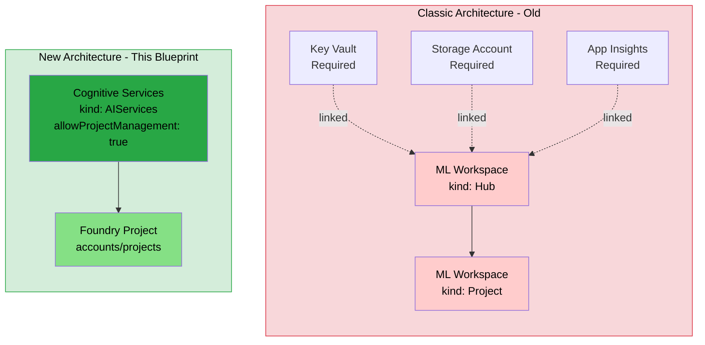
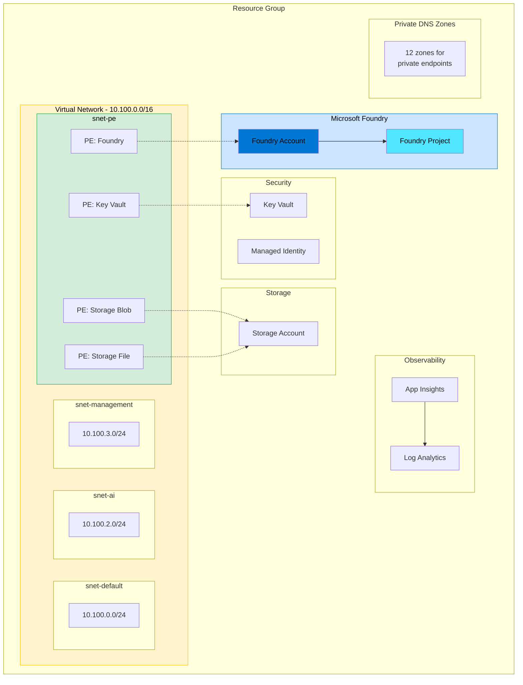

# Azure Foundry Blueprints

[](https://www.terraform.io/)
[](https://learn.microsoft.com/en-us/azure/azure-resource-manager/bicep/)
[](https://azure.microsoft.com/)
[](LICENSE)

[](https://connect.codetocloud.io)
[](https://connect.codetocloud.io)
[](https://connect.codetocloud.io)

> **⚠️ Disclaimer:** This code is provided as-is, with no warranties or guarantees of any kind. Use at your own risk. Always test thoroughly in non-production environments before deploying to production.

Enterprise-ready Microsoft Foundry deployment blueprints using **Bicep** and **Terraform**, aligned with modern Microsoft cloud architecture standards and [Azure AI Landing Zone](https://aka.ms/ailz) best practices.

---

## 📑 Table of Contents

- [New Foundry Experience](#-new-foundry-experience-by-default)
- [What Gets Deployed](#what-gets-deployed)
- [Quick Start](#quick-start)
- [Design Principles](#design-principles)
- [After Deployment](#-after-deployment)
- [Cleanup](#-cleanup)
- [Known Limitations](#-known-limitations)
- [Documentation](#documentation)
- [Contributing & Support](#-contributing--support)
- [References](#references)

---

## 🚀 New Foundry Experience by Default

**This blueprint deploys the NEW Microsoft Foundry portal experience** — not the classic Azure AI Studio hub-based model.

| What You Get | Resource Type | Key Property |
|--------------|---------------|---------------|
| **New Foundry Portal** | `Microsoft.CognitiveServices/accounts` (kind: `AIServices`) | `allowProjectManagement: true` |
| **New Project Type** | `Microsoft.CognitiveServices/accounts/projects` | Child resource of Foundry account |

### Why the New Architecture?

Microsoft has introduced a **new Foundry experience** that moves away from the classic Azure Machine Learning workspace model:

| Classic (Old) | New (This Blueprint) |
|---------------|----------------------|
| `Microsoft.MachineLearningServices/workspaces` (kind: `Hub`) | `Microsoft.CognitiveServices/accounts` (kind: `AIServices`) |
| `Microsoft.MachineLearningServices/workspaces` (kind: `Project`) | `Microsoft.CognitiveServices/accounts/projects` |
| Required: Key Vault, Storage, App Insights linked | Standalone — no required linked resources |
| Classic AI Studio portal | **New Foundry portal** with agents, evaluations, AI apps |

The **key enabler** is `allowProjectManagement: true` — this unlocks the modern Foundry portal where you can:
- Build and deploy AI agents
- Run evaluations and experiments
- Create AI applications
- Manage projects as first-class citizens

### Architecture: New vs Classic



## Overview

This repository provides a developer-focused, enterprise-style reference implementation for deploying [Microsoft Foundry](https://learn.microsoft.com/en-us/azure/ai-services/foundry/) using Infrastructure-as-Code.

> **Note:** This is for development and learning — not a production landing zone.
>
> **Recommendation:** For production, use [Azure Verified Modules (AVM)](https://aka.ms/avm) and the [Azure AI Landing Zone](https://aka.ms/ailz) accelerator.

## What Gets Deployed

### Deployment Architecture



| Resource                    | Purpose                              |
|-----------------------------|--------------------------------------|
| Resource Group              | Container for all resources          |
| Virtual Network             | 4 segmented subnets (`/16`)          |
| Network Security Groups     | Default-deny microsegmentation       |
| Log Analytics Workspace     | Centralized logging                  |
| Application Insights        | Foundry telemetry                    |
| User-Assigned Managed Identity | Least-privilege identity           |
| Key Vault                   | Secrets, RBAC-authorized             |
| Storage Account             | Foundry workspace storage            |
| Microsoft Foundry           | AI Services account (`allowProjectManagement: true`) |
| Foundry Project             | Team/workload isolation boundary     |
| 12 Private DNS Zones        | Private endpoint name resolution     |
| 4 Private Endpoints         | Key Vault, Blob, File, Foundry       |

### Why AzAPI / Direct ARM?

We use **AzAPI provider** in Terraform (and direct ARM properties in Bicep) because:

1. **Latest API version** (`2025-06-01`) — Includes `allowProjectManagement` and project child resources
2. **Schema not yet available** — The new properties aren't in AzureRM or Bicep type schemas yet
3. **Portal parity** — This is exactly how the Azure portal creates Foundry resources
4. **Future-proof** — Your IaC will already be aligned when official support arrives

## Repository Structure

```
azure-foundry-blueprints/
├── bicep/
│   ├── modules/          # Reusable Bicep modules
│   └── dev/              # Dev environment deployment
├── terraform/
│   ├── modules/          # Reusable Terraform modules
│   └── dev/              # Dev environment deployment
├── docs/
│   ├── architecture.md   # Architecture overview
│   ├── networking.md     # Networking deep dive
│   └── observability.md  # Observability strategy
├── shared/
│   ├── naming/           # Naming conventions
│   ├── tags/             # Tagging strategy
│   └── network-design/   # Network address planning
├── scripts/
│   ├── bootstrap/        # Azure environment setup
│   └── validate/         # Pre-deploy validation
└── .github/workflows/    # CI validation pipelines
```

## Quick Start

> **⏱️ Deployment Time:** ~10-15 minutes | **💰 Cost:** Pay-as-you-go Azure resources (AI Services, Storage, Key Vault, etc.)

### Prerequisites

| Requirement | Minimum Version | Install Guide |
|-------------|-----------------|---------------|
| Azure CLI | >= 2.50 | [Install Azure CLI](https://learn.microsoft.com/en-us/cli/azure/install-azure-cli) |
| Bicep CLI | >= 0.28 | `az bicep install` |
| Terraform | >= 1.5 | [Install Terraform](https://developer.hashicorp.com/terraform/install) |
| Azure Subscription | — | Owner or Contributor + User Access Administrator |

**Verify your setup:**

```bash
# Run all checks at once
echo "=== Checking Prerequisites ===" && \
az version --query '{"Azure CLI": "azure-cli"}' -o table && \
az bicep version && \
terraform version | head -1 && \
az account show --query "{Subscription:name, State:state}" -o table && \
echo "=== All checks passed! ==="
```

<details>
<summary>📋 Individual verification commands (click to expand)</summary>

```bash
# 1. Check Azure CLI version (need >= 2.50)
az version

# 2. Check you're logged in and see your subscription
az account show --query "{Name:name, ID:id, State:state}" -o table

# 3. Check Bicep is installed
az bicep version

# 4. Check Terraform version (need >= 1.5)
terraform version

# 5. Verify required Azure providers are registered
az provider show -n Microsoft.CognitiveServices --query "registrationState" -o tsv
az provider show -n Microsoft.Network --query "registrationState" -o tsv
az provider show -n Microsoft.KeyVault --query "registrationState" -o tsv
```

</details>

### 1. Clone & Bootstrap

```bash
git clone https://github.com/kevinevans1/azure-foundry-blueprints.git
cd azure-foundry-blueprints

# Bootstrap Azure environment (optional - creates backend storage)
./scripts/bootstrap/setup-azure.sh
```

### 2. Deploy with Terraform

```bash
cd terraform/dev
terraform init
terraform plan -var-file="dev.tfvars"
terraform apply -var-file="dev.tfvars"
```

### 3. Deploy with Bicep

```bash
cd bicep/dev
az deployment sub create \
  --location eastus2 \
  --template-file main.bicep \
  --parameters main.bicepparam
```

## Design Principles

- **Private networking first** — All PaaS services accessed via private endpoints
- **Secure by default** — RBAC, managed identities, encryption enabled
- **Observable** — Log Analytics + App Insights deployed before workloads
- **Modular** — Single-responsibility modules, reusable across environments
- **Terraform/Bicep parity** — Both flavours deploy identical architectures
- **Enterprise patterns** — Layered architecture preserved even for dev

---

## 🎯 After Deployment

Once deployed, you can:

1. **Access the Foundry Portal** — Navigate to [ai.azure.com](https://ai.azure.com) and select your project
2. **Build AI Agents** — Use the agent builder to create conversational AI
3. **Run Evaluations** — Test and benchmark your models
4. **Deploy Models** — Deploy OpenAI or custom models to your Foundry resource
5. **Connect from Code** — Use the endpoint URL from the deployment outputs

```bash
# Get the Foundry endpoint (Terraform)
terraform output foundry_endpoint

# Get the Foundry endpoint (Bicep)
az deployment sub show --name <deployment-name> --query properties.outputs.foundryEndpoint.value
```

---

## 🧹 Cleanup

**Terraform:**
```bash
cd terraform/dev
terraform destroy -var-file="dev.tfvars"
```

**Bicep:**
```bash
# Delete the resource group (adjust name based on your parameters)
az group delete --name rg-foundry-dev-eus2-001 --yes --no-wait
```

> **Note:** Soft-deleted Key Vaults and AI Services may need to be purged manually if you want to reuse the same names.

---

## ⚠️ Known Limitations

| Limitation | Details |
|------------|---------|
| **API Schema** | The `allowProjectManagement` property isn't in Bicep/AzureRM schemas yet — we use `#disable-next-line` directives |
| **Region Availability** | Not all Azure regions support AI Services with project management — check [Azure products by region](https://azure.microsoft.com/en-us/explore/global-infrastructure/products-by-region/) |
| **Private Endpoints** | Full private networking requires a jump box or VPN to access the Foundry portal privately |
| **Soft Delete** | Key Vault and AI Services have soft-delete enabled by default — purge before redeploying with same names |
| **Quotas** | AI Services have regional quotas — request increases if deploying multiple instances |

---

## Documentation

| Document | Description |
|----------|-------------|
| [Architecture](docs/architecture.md) | Platform layering, resource inventory, deployment order |
| [Networking](docs/networking.md) | VNet design, subnets, DNS zones, private endpoints |
| [Observability](docs/observability.md) | Logging, monitoring, diagnostic settings |
| [Contributing](CONTRIBUTING.md) | How to contribute |

---

## 🤝 Contributing & Support

**Contributions welcome!** Please read [CONTRIBUTING.md](CONTRIBUTING.md) before submitting PRs.

- **🐛 Found a bug?** [Open an issue](https://github.com/kevinevans1/azure-foundry-blueprints/issues/new)
- **💡 Have an idea?** [Start a discussion](https://github.com/kevinevans1/azure-foundry-blueprints/discussions)
- **📖 Questions?** Check the [docs](docs/) or open a discussion

---

## References

| Resource | Description |
|----------|-------------|
| [Microsoft Foundry Docs](https://learn.microsoft.com/en-us/azure/ai-services/foundry/) | Official Foundry documentation |
| [Azure Verified Modules](https://aka.ms/avm) | Production-ready IaC modules |
| [Azure AI Landing Zone](https://aka.ms/ailz) | Enterprise AI reference architecture |
| [Private Endpoint DNS](https://learn.microsoft.com/en-us/azure/private-link/private-endpoint-dns) | DNS configuration for private endpoints |
| [CAF AI Scenario](https://learn.microsoft.com/en-us/azure/cloud-adoption-framework/scenarios/ai/) | Cloud Adoption Framework for AI |

---

<p align="center">
  <strong>Made with ❤️ for the Azure community</strong><br/>
  <sub>If this helps you, give it a ⭐</sub>
</p>

