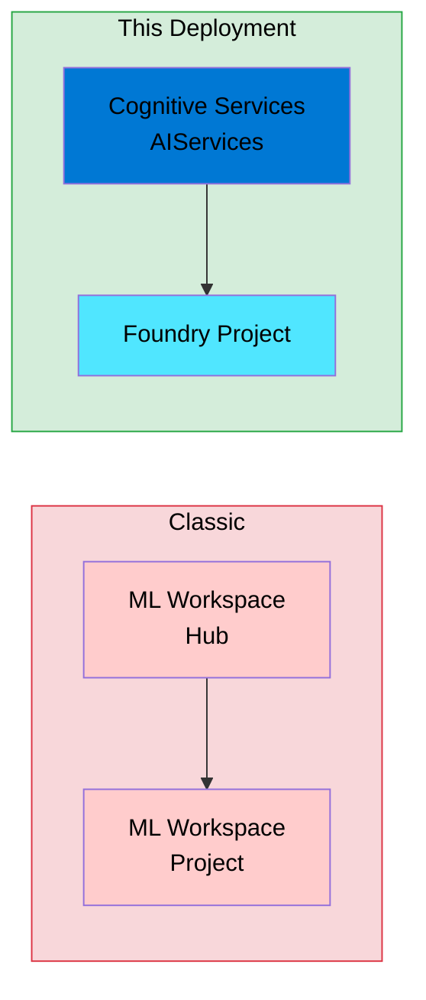
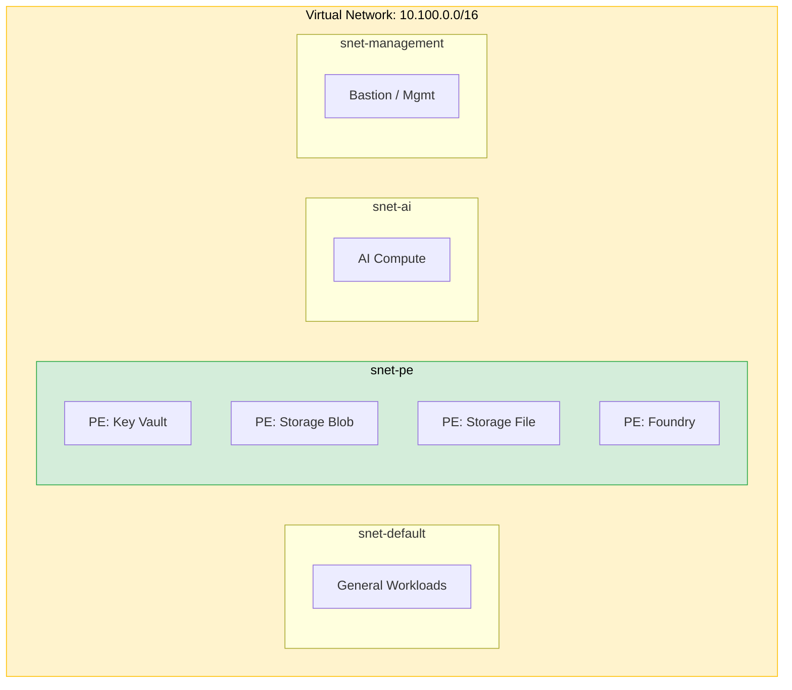

# Bicep Dev Spoke Deployment

> **⚠️ Disclaimer:** This code is provided as-is, with no warranties or guarantees. Use at your own risk.

## 🚀 Deploys the New Foundry Experience

This deployment creates the **NEW Microsoft Foundry portal experience** — not the classic Azure AI Studio hub-based model.

- **Foundry Account**: `Microsoft.CognitiveServices/accounts` with `allowProjectManagement: true`
- **Foundry Project**: `Microsoft.CognitiveServices/accounts/projects` (new project type)

This enables the modern Foundry portal for building agents, running evaluations, and deploying AI applications.



## Architecture

This deployment creates:

| Resource | Name Pattern | Purpose |
|----------|-------------|---------|
| Resource Group | `rg-foundry-dev-eus2-001` | Container for all resources |
| Virtual Network | `vnet-foundry-dev-eus2-001` | 10.100.0.0/16 with 4 subnets |
| NSGs | `nsg-{subnet}-foundry-dev-eus2-001` | One per subnet, deny-internet default |
| Log Analytics | `log-foundry-dev-eus2-001` | Centralized logging |
| Application Insights | `appi-foundry-dev-eus2-001` | Telemetry and APM |
| Managed Identity | `id-foundry-dev-eus2-001` | Workload identity (no secrets) |
| Storage Account | `stfoundrydeveus2001` | Data store |
| Key Vault | `kv-foundry-dev-eus2-001` | Secret management (RBAC, purge-protected) |
| Private DNS Zones | `privatelink.*` | FQDN resolution for private endpoints |
| Microsoft Foundry | `aihub-foundry-dev-eus2-001` | AI Services account with `allowProjectManagement: true` |
| Foundry Project | `aiproj-foundry-dev-eus2-001` | Team/workload isolation boundary |
| Private Endpoints | `pep-{service}-foundry-dev-eus2-001` | Key Vault, Storage, Foundry |

### Subnet Layout



| Subnet | CIDR | Purpose |
|--------|------|---------|
| `snet-default` | 10.100.0.0/24 | General workloads |
| `snet-pe` | 10.100.1.0/24 | Private endpoints |
| `snet-ai` | 10.100.2.0/24 | AI Foundry compute |
| `snet-management` | 10.100.3.0/24 | Management / bastion |

## Prerequisites

- Azure CLI ≥ 2.61 with Bicep CLI ≥ 0.28
- An Azure subscription with Contributor + User Access Administrator roles
- Logged in: `az login`

## Deploy

```bash
# Validate first
az deployment sub validate \
  --location eastus2 \
  --template-file ./main.bicep \
  --parameters ./main.bicepparam

# Deploy
az deployment sub create \
  --location eastus2 \
  --template-file ./main.bicep \
  --parameters ./main.bicepparam \
  --name foundry-dev-$(date +%Y%m%d%H%M%S)
```

## Tear Down

```bash
az group delete --name rg-foundry-dev-eus2-001 --yes --no-wait
```

## Customisation

Override parameters at deploy time:

```bash
az deployment sub create \
  --location eastus2 \
  --template-file ./main.bicep \
  --parameters ./main.bicepparam \
  --parameters instance=002 owner=my-team
```

Or edit `main.bicepparam` directly for persistent changes.
