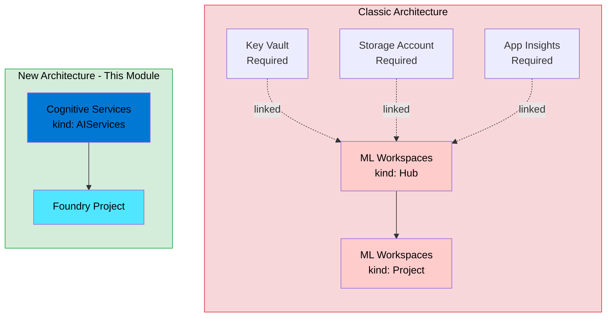

# Microsoft Foundry: Deploying with the New Cognitive Services Architecture

> **⚠️ Disclaimer:** This code is provided as-is, with no warranties or guarantees of any kind. Use at your own risk. Always test thoroughly in non-production environments before deploying to production. This is sample code intended for learning and experimentation purposes.

## 🚀 This Module Deploys the NEW Foundry Experience

| What You Get | Resource Type | Key Property |
|--------------|---------------|---------------|
| **New Foundry Portal** | `Microsoft.CognitiveServices/accounts` (kind: `AIServices`) | `allowProjectManagement: true` |
| **New Project Type** | `Microsoft.CognitiveServices/accounts/projects` | Child resource of Foundry account |

**This is NOT the classic Azure AI Studio hub/project model.** This module deploys the modern Foundry experience for building agents, running evaluations, and deploying AI applications.

## Introduction

If you've been working with Azure AI Foundry recently, you may have noticed the landscape is evolving rapidly. The platform has undergone a significant architectural shift — moving away from the classic **Azure Machine Learning hub/project** model towards a new **Cognitive Services-based** approach that enables exciting capabilities like project management directly within the Foundry portal.

This module implements the **new architecture** using `Microsoft.CognitiveServices/accounts` with `kind: AIServices` and the critical `allowProjectManagement: true` property.

## Why the New Architecture?



### The Classic Approach (What We're Moving Away From)

Previously, Azure AI Foundry was built on top of Azure Machine Learning workspaces:

- **Hub** = `Microsoft.MachineLearningServices/workspaces` with `kind: Hub`
- **Project** = `Microsoft.MachineLearningServices/workspaces` with `kind: Project`

This required wiring up separate resources: Key Vault, Storage Account, Application Insights, and Container Registry — all managed through the ML workspace construct.

### The New Approach (What This Module Uses)

The new architecture is built on **Azure AI Services** (formerly Cognitive Services):

- **Foundry Resource** = `Microsoft.CognitiveServices/accounts` with `kind: AIServices`
- **Project** = `Microsoft.CognitiveServices/accounts/projects`

The key enabler is the `allowProjectManagement` property, which unlocks the **modern Foundry portal experience** — where you can build agents, run evaluations, and deploy AI applications without the overhead of the ML workspace model.

### Why We Use This API Pattern (Similar to AzAPI in Terraform)

You might wonder: *"Why not wait for official Azure Resource Manager templates or higher-level abstractions?"*

The reality is that **Azure AI is moving fast**. The new Foundry architecture uses API versions and properties that may not yet be fully documented or available in all tooling. By using the direct ARM API (or AzAPI in Terraform), we gain:

1. **Access to the latest features** — Properties like `allowProjectManagement` enable capabilities that higher-level abstractions may not yet expose.
2. **Consistency with the portal** — When you create a Foundry resource in the Azure portal, it uses this exact API pattern.
3. **Future-proofing** — As the API stabilises, your infrastructure code will already be aligned.

## Resources Deployed

| Resource | Type | Purpose |
|----------|------|---------|
| Microsoft Foundry | `Microsoft.CognitiveServices/accounts` (kind: `AIServices`) | The top-level AI Services account with project management enabled |
| Foundry Project | `Microsoft.CognitiveServices/accounts/projects` | Team/workload isolation boundary for building AI applications |

## Parameters

| Name | Type | Default | Description |
|------|------|---------|-------------|
| `foundryName` | `string` | — | Name of the Foundry resource (2–64 chars). |
| `projectName` | `string` | `''` | Name of the project. Leave empty to skip creation. |
| `projectDescription` | `string` | `'Development project'` | Description for the project. |
| `location` | `string` | — | Azure region for deployment. |
| `skuName` | `string` | `'S0'` | SKU tier (e.g., `S0`). |
| `customSubdomainName` | `string` | — | Globally unique subdomain for the endpoint. |
| `identityIds` | `array` | `[]` | User-assigned managed identity resource IDs. |
| `publicNetworkAccess` | `string` | `'Disabled'` | `Enabled` or `Disabled`. |
| `disableLocalAuth` | `bool` | `false` | Disable API keys (managed identity only). |
| `tags` | `object` | `{}` | Tags to apply. |

## Outputs

| Name | Type | Description |
|------|------|-------------|
| `id` | `string` | Resource ID of the Foundry resource. |
| `endpoint` | `string` | The Cognitive Services endpoint URL. |
| `principalId` | `string` | Principal ID of the system-assigned identity. |
| `projectId` | `string` | Resource ID of the project (empty if not created). |

## Example Usage

```bicep
module foundry 'modules/foundry/main.bicep' = {
  name: 'foundry-deployment'
  params: {
    foundryName: 'foundry-dev-swedencentral'
    projectName: 'project-dev-001'
    projectDescription: 'Development project for AI agents'
    location: 'swedencentral'
    customSubdomainName: 'myorg-foundry-dev'
    identityIds: [managedIdentity.outputs.id]
    publicNetworkAccess: 'Disabled'
    disableLocalAuth: true
    tags: {
      environment: 'dev'
      workload: 'ai-foundry'
    }
  }
}
```

## Recommended Resources

### Azure Verified Modules

For production deployments, organisations should consider using **Azure Verified Modules (AVM)** where available. AVM provides Microsoft-supported, well-tested modules that follow Azure best practices:

🔗 [Azure Verified Modules Registry](https://aka.ms/avm)

AVM modules offer:
- Consistent quality and testing standards
- Regular updates aligned with Azure platform changes
- Community support and contributions
- Compliance with Azure Well-Architected Framework

### Azure AI Landing Zone

If you're deploying AI workloads at scale, consider the **Azure AI Landing Zone** accelerator, which provides a comprehensive reference architecture for enterprise AI:

🔗 [Azure AI Landing Zone](https://aka.ms/ailz)

The AI Landing Zone covers:
- Network topology and connectivity
- Identity and access management
- Security and governance
- Monitoring and operations
- Cost management

## Further Reading

- [Microsoft Foundry Documentation](https://learn.microsoft.com/en-us/azure/ai-services/foundry/)
- [Create Foundry Resources with Terraform](https://learn.microsoft.com/en-us/azure/foundry/how-to/create-resource-terraform)
- [Azure AI Services Overview](https://learn.microsoft.com/en-us/azure/ai-services/)

---

*This module is part of the Azure Foundry Blueprints repository — a collection of infrastructure-as-code patterns for deploying Microsoft Foundry resources.*
