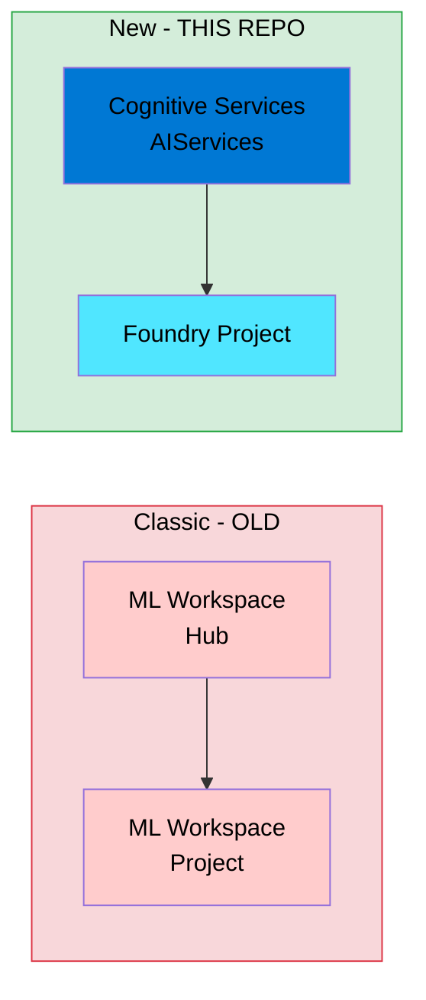
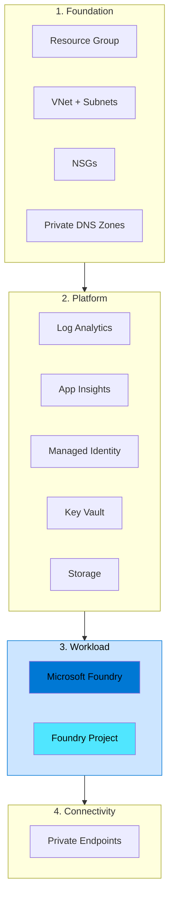

# Azure Foundry Blueprints — Instructions

## Overview

**azure-foundry-blueprints** provides a developer-focused, enterprise-style reference implementation for deploying Microsoft Foundry using Infrastructure-as-Code (IaC).

Supported IaC flavours:
- **Terraform** (using AzAPI provider for latest APIs)
- **Bicep**

### ⚡ New Foundry Experience by Default

This repository deploys the **NEW Microsoft Foundry portal experience** — not the classic Azure AI Studio hub-based model.

| Resource | Type | Purpose |
|----------|------|----------|
| Foundry Account | `Microsoft.CognitiveServices/accounts` (kind: `AIServices`) | Top-level resource with `allowProjectManagement: true` |
| Foundry Project | `Microsoft.CognitiveServices/accounts/projects` | Team/workload isolation boundary |

The classic approach used `Microsoft.MachineLearningServices/workspaces` with Hub/Project kinds — this is the OLD architecture. We deploy the NEW architecture which enables the modern Foundry portal for building agents, running evaluations, and deploying AI applications.



### Key Goals

- Deploy the **new Foundry experience** with `allowProjectManagement: true`
- Use the **new project resource type** (`accounts/projects`)
- Maintain parity between Terraform and Bicep
- Provide a self-contained dev-focused spoke environment
- Teach enterprise practices without production complexity

> **⚠️ Disclaimer:** This code is provided as-is, with no warranties or guarantees. Use at your own risk. This repository is for development and learning purposes only — not a production landing zone.

> **Recommendation:** For production deployments, consider using [Azure Verified Modules (AVM)](https://aka.ms/avm) and the [Azure AI Landing Zone](https://aka.ms/ailz) accelerator.

---

## Design Philosophy

- Enterprise architecture patterns preserved
- Self-contained spoke: no hub, no peering dependencies
- Private networking first, secure-by-default
- Observability enabled (Application Insights + Log Analytics)
- Reusable modular IaC
- Developer-focused deployment: quick and understandable

---

## Platform Layering Model (Developer Edition)

Even for dev, we preserve the concept of layers:



| Enterprise Concept | Dev Implementation                |
|--------------------|-----------------------------------|
| Foundation Layer   | Included inside dev deployment    |
| Platform Layer     | Included inside dev deployment    |
| Workload Layer     | Azure Foundry deployment          |
| Environment Layer  | Dev only                          |

---

## Repository Structure

```
azure-foundry-blueprints/
├── README.md
├── copilot-instructions.md
├── CONTRIBUTING.md
├── docs/
│   ├── architecture.md
│   ├── networking.md
│   └── observability.md
├── bicep/
│   ├── modules/
│   └── dev/
├── terraform/
│   ├── modules/
│   └── dev/
├── shared/
│   ├── naming/
│   ├── tags/
│   └── network-design/
├── scripts/
│   ├── bootstrap/
│   └── validate/
└── .github/
    └── workflows/
```

**Notes:**

- Terraform and Bicep mirror each other
- All infrastructure is modular, even for dev
- Only a single dev environment is included to simplify usage

---

## Module Best Practices

- Modular, reusable building blocks
- Parameterized inputs, meaningful outputs
- Single responsibility per module
- Avoid hard-coded environment values
- Prefer **Azure Verified Modules (AVM)** where available
- All modules documented with clear intent and guidance

---

## Terraform Standards

- Remote backend required (Azure Storage recommended)
- State locking enabled
- Separate state per layer/environment
- Providers centrally managed and version pinned
- Root modules orchestrate only; logic lives in `/modules`
- Follow enterprise folder naming conventions

---

## Bicep Standards

- Modular architecture
- Reusable modules under `/modules`
- Environment parameter files
- Avoid large monolithic deployments
- Prefer AVM Bicep modules
- Maintain parity with Terraform architecture

---

## Networking Standards

Even in a dev environment, enforce:

- Segmented subnets
- Private endpoints for all supported resources
- Public access disabled where possible
- Private DNS zones configured
- Minimal controlled internet breakout
- Enterprise-style address planning

### Required Private DNS Zones

All zones below must be deployed and linked to the spoke VNet:

| DNS Zone                                         | Purpose                              |
|--------------------------------------------------|--------------------------------------|
| `privatelink.api.azureml.ms`                     | AI Foundry Hub (ML workspace)        |
| `privatelink.notebooks.azure.net`                | AI Foundry compute & notebooks       |
| `privatelink.cognitiveservices.azure.com`         | Cognitive Services                   |
| `privatelink.openai.azure.com`                   | Azure OpenAI endpoints               |
| `privatelink.aiservices.azure.com`               | Azure AI Services                    |
| `privatelink.vaultcore.azure.net`                | Key Vault                            |
| `privatelink.blob.core.windows.net`              | Blob Storage                         |
| `privatelink.file.core.windows.net`              | File Storage (Foundry workspace)     |
| `privatelink.monitor.azure.com`                  | Azure Monitor                        |
| `privatelink.ods.opinsights.azure.com`           | Log Analytics                        |
| `privatelink.oms.opinsights.azure.com`           | Log Analytics OMS                    |
| `privatelink.agentsvc.azure-automation.net`      | Automation                           |

### Required Private Endpoints

| Endpoint Target    | Subresource      | DNS Zones                                                        |
|--------------------|------------------|------------------------------------------------------------------|
| Key Vault          | `vault`          | `privatelink.vaultcore.azure.net`                                |
| Storage Account    | `blob`           | `privatelink.blob.core.windows.net`                              |
| Storage Account    | `file`           | `privatelink.file.core.windows.net`                              |
| Microsoft Foundry  | `account`        | `cognitiveservices.azure.com`, `openai.azure.com`, `aiservices.azure.com` |

> **Note:** The new Foundry architecture uses Cognitive Services (`account` subresource), not ML workspaces (`amlworkspace`).

> **Reference:** [Microsoft Foundry Documentation](https://learn.microsoft.com/en-us/azure/ai-services/foundry/), [Azure AI Landing Zones](https://aka.ms/ailz)

---

## Observability

- Application Insights deployed for Foundry
- Log Analytics workspace deployed
- Diagnostic settings applied to all supported resources
- Centralized metrics and logging enabled
- Observability resources deployed **before workloads**

---

## Security Standards

- Least privilege RBAC
- Managed identities preferred
- Encryption enabled by default
- Secure defaults enforced
- Private networking enforced

---

## Developer Deployment Flow

```
Local Validation → Deploy Dev Spoke → Fix Errors → Experiment Safely
```

**Local validation:**
- `terraform fmt`, `terraform validate`, `terraform plan`
- `bicep build`, lint checks

**Azure validation:**
- Deploy dev environment
- Catch errors
- Confirm networking and observability

---

## Quick Start

1. Bootstrap Azure environment
2. Choose deployment flavour (Terraform or Bicep)
3. Deploy dev environment

**Goal:** Deploy in under 15 minutes.

---

## Code Quality Expectations

- Comment all code clearly
- Explain architectural and networking intent
- Document security decisions
- Enable new developers to understand infrastructure without external documentation

---

## Contributor Guidance

- Maintain Terraform/Bicep parity
- Follow module boundaries
- Respect networking and security guardrails
- Validate locally and in Azure before PRs
- Keep infrastructure modular and reusable
