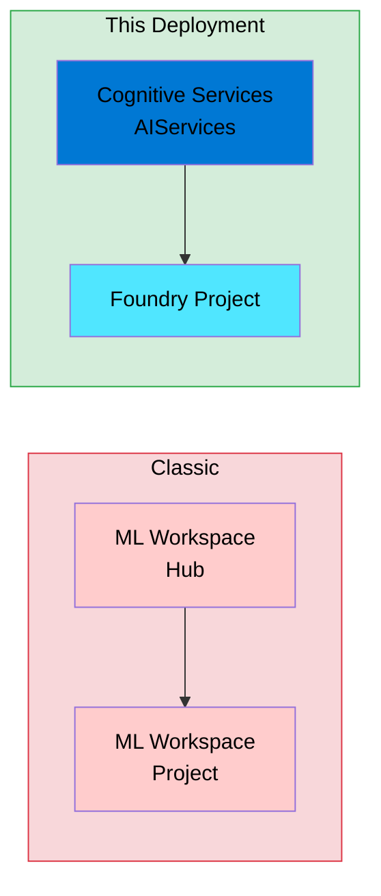
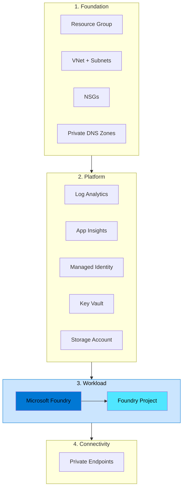

# Terraform — Dev Spoke Environment

> **⚠️ Disclaimer:** This code is provided as-is, with no warranties or guarantees. Use at your own risk.

## 🚀 Deploys the New Foundry Experience

This deployment creates the **NEW Microsoft Foundry portal experience** — not the classic Azure AI Studio hub-based model.

- **Foundry Account**: `Microsoft.CognitiveServices/accounts` with `allowProjectManagement: true`
- **Foundry Project**: `Microsoft.CognitiveServices/accounts/projects` (new project type)

We use the **AzAPI provider** because the new Foundry properties aren't yet available in AzureRM. This gives us access to the `2025-06-01` API version with full support for the new architecture.



## What Gets Deployed



| Layer | Resources |
|-------|----------|
| Foundation | Resource Group, VNet, Subnets, NSGs, Private DNS Zones |
| Platform | Log Analytics, Application Insights, Managed Identity, Key Vault, Storage Account |
| Workload | Microsoft Foundry (AI Services + Project) |
| Connectivity | Private Endpoints for Key Vault, Storage, Foundry |

## Prerequisites

- [Terraform](https://developer.hashicorp.com/terraform/install) >= 1.5
- [Azure CLI](https://learn.microsoft.com/cli/azure/install-azure-cli) >= 2.50
- An active Azure subscription
- Logged in: `az login`

## Quick Start

```bash
# 1. Initialise Terraform (downloads providers)
terraform init

# 2. Review the execution plan
terraform plan -var-file="dev.tfvars"

# 3. Apply the deployment
terraform apply -var-file="dev.tfvars"
```

## Customisation

Override any variable in `dev.tfvars` or pass values via CLI:

```bash
terraform plan -var-file="dev.tfvars" -var="location=swedencentral"
```

See [`variables.tf`](variables.tf) for the full list of inputs and their defaults.

## Remote State (Optional)

Uncomment the `backend "azurerm"` block in [`providers.tf`](providers.tf) and configure it for your storage account:

```bash
terraform init \
  -backend-config="resource_group_name=rg-terraform-state" \
  -backend-config="storage_account_name=stterraformstate" \
  -backend-config="container_name=tfstate" \
  -backend-config="key=foundry-dev.tfstate"
```

## Tear Down

```bash
terraform destroy -var-file="dev.tfvars"
```

## Naming Convention

All resources follow the pattern `{prefix}-{workload}-{env}-{region_short}-{instance}`. See [`/shared/naming/README.md`](../../shared/naming/README.md) for details.
