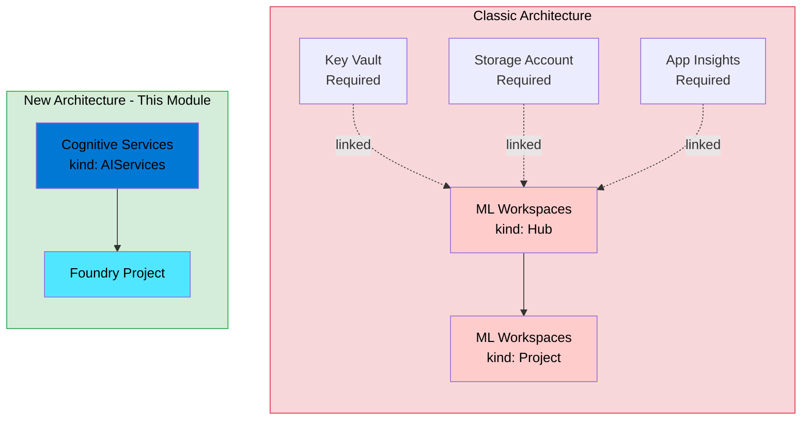

# Microsoft Foundry: Deploying with AzAPI and the New Cognitive Services Architecture

> **⚠️ Disclaimer:** This code is provided as-is, with no warranties or guarantees of any kind. Use at your own risk. Always test thoroughly in non-production environments before deploying to production. This is sample code intended for learning and experimentation purposes.

## 🚀 This Module Deploys the NEW Foundry Experience

| What You Get | Resource Type | Key Property |
|--------------|---------------|---------------|
| **New Foundry Portal** | `Microsoft.CognitiveServices/accounts@2025-06-01` (kind: `AIServices`) | `allowProjectManagement: true` |
| **New Project Type** | `Microsoft.CognitiveServices/accounts/projects@2025-06-01` | Child resource of Foundry account |

**This is NOT the classic Azure AI Studio hub/project model.** This module deploys the modern Foundry experience for building agents, running evaluations, and deploying AI applications.

## Introduction

If you've been working with Azure AI Foundry recently, you may have noticed the landscape is evolving rapidly. The platform has undergone a significant architectural shift — moving away from the classic **Azure Machine Learning hub/project** model towards a new **Cognitive Services-based** approach that enables exciting capabilities like project management directly within the Foundry portal.

This module uses the **AzAPI provider** to implement the new architecture with `Microsoft.CognitiveServices/accounts` (kind: `AIServices`) and the critical `allowProjectManagement = true` property.

## Why AzAPI?

### The Challenge with Standard Providers

The AzureRM provider is excellent for stable, well-established resources. However, **Azure AI is moving fast**. New API versions, properties, and capabilities are released frequently — often before they're available in the AzureRM provider.

The `azurerm_ai_foundry` and `azurerm_ai_foundry_project` resources use the classic **MachineLearningServices** architecture, which doesn't support the newer Foundry portal experience.

### Why AzAPI is the Right Choice Here

The **AzAPI provider** gives us direct access to the Azure Resource Manager API, enabling:

1. **Access to the latest API versions** — We're using `2025-06-01` which includes the newest Foundry capabilities.
2. **The `allowProjectManagement` property** — This unlocks the modern Foundry portal experience for building agents, evaluations, and AI applications.
3. **Future-proofing** — As the API stabilises and potentially moves into AzureRM, your infrastructure code will already be aligned.
4. **Consistency with the Azure Portal** — When you create a Foundry resource in the portal, it uses this exact API pattern.

### The Key Property: `allowProjectManagement`

```hcl
properties = {
  allowProjectManagement = true  # This is the magic!
  # ...
}
```

Setting `allowProjectManagement = true` enables the **new Foundry portal experience** — where projects are first-class citizens and you can build agents, run evaluations, and deploy AI applications without the overhead of the ML workspace model.



## Resources Deployed

| Resource | Type | Purpose |
|----------|------|---------|
| Microsoft Foundry | `Microsoft.CognitiveServices/accounts@2025-06-01` (kind: `AIServices`) | The top-level AI Services account with project management enabled |
| Foundry Project | `Microsoft.CognitiveServices/accounts/projects@2025-06-01` | Team/workload isolation boundary for building AI applications |

## Usage

```hcl
module "foundry" {
  source = "../modules/foundry"

  foundry_name          = "foundry-dev-swedencentral"
  project_name          = "project-dev-001"
  project_description   = "Development project for AI agents"
  resource_group_name   = module.resource_group.name
  location              = "swedencentral"
  custom_subdomain_name = "myorg-foundry-dev"
  
  identity_ids          = [module.identity.id]
  public_network_access = "Disabled"
  disable_local_auth    = true

  tags = {
    environment = "dev"
    workload    = "ai-foundry"
  }
}
```

## Inputs

| Name | Description | Type | Default | Required |
|------|-------------|------|---------|----------|
| `foundry_name` | Name of the Foundry resource (AI Services account) | `string` | — | yes |
| `project_name` | Name of the project (null to skip creation) | `string` | `null` | no |
| `project_description` | Description for the project | `string` | `"Development project"` | no |
| `resource_group_name` | Resource group containing the resources | `string` | — | yes |
| `location` | Azure region | `string` | — | yes |
| `sku_name` | SKU tier (e.g., S0) | `string` | `"S0"` | no |
| `custom_subdomain_name` | Globally unique subdomain for the endpoint | `string` | — | yes |
| `identity_ids` | User-assigned managed identity IDs | `list(string)` | `null` | no |
| `public_network_access` | Public access (`Enabled` or `Disabled`) | `string` | `"Disabled"` | no |
| `disable_local_auth` | Disable API keys (managed identity only) | `bool` | `false` | no |
| `tags` | Tags to apply | `map(string)` | `{}` | no |

## Outputs

| Name | Description |
|------|-------------|
| `id` | Resource ID of the Foundry resource |
| `endpoint` | The Cognitive Services endpoint URL |
| `principal_id` | Principal ID of the system-assigned identity |
| `project_id` | Resource ID of the project (null if not created) |

## Recommended Resources

### Azure Verified Modules

For production deployments, organisations should consider using **Azure Verified Modules (AVM)** where available. AVM provides Microsoft-supported, well-tested modules that follow Azure best practices:

🔗 [Azure Verified Modules Registry](https://aka.ms/avm)

AVM modules offer:
- Consistent quality and testing standards
- Regular updates aligned with Azure platform changes
- Community support and contributions
- Compliance with Azure Well-Architected Framework

### Azure AI Landing Zone

If you're deploying AI workloads at scale, consider the **Azure AI Landing Zone** accelerator, which provides a comprehensive reference architecture for enterprise AI:

🔗 [Azure AI Landing Zone](https://aka.ms/ailz)

The AI Landing Zone covers:
- Network topology and connectivity
- Identity and access management
- Security and governance
- Monitoring and operations
- Cost management

## Further Reading

- [Microsoft Foundry Documentation](https://learn.microsoft.com/en-us/azure/ai-services/foundry/)
- [Create Foundry Resources with Terraform](https://learn.microsoft.com/en-us/azure/foundry/how-to/create-resource-terraform)
- [AzAPI Provider Documentation](https://registry.terraform.io/providers/Azure/azapi/latest/docs)
- [Azure AI Services Overview](https://learn.microsoft.com/en-us/azure/ai-services/)

---

*This module is part of the Azure Foundry Blueprints repository — a collection of infrastructure-as-code patterns for deploying Microsoft Foundry resources.*
